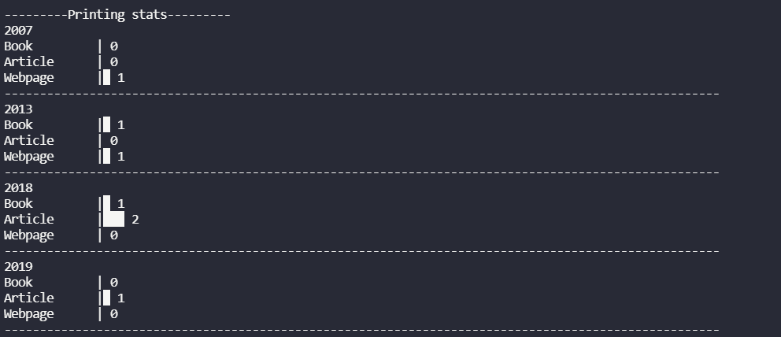

# PDP Home Work 1 : Creating the Reference Manger to manage Books,Articles and WebPages

## Project Description :

In this project, there were totally 5 classes:

1. Publication (Parent)
2. Book (Child of 1)
3. Article (Child of 1)
4. WebPages (Child of 1)
5. Reference Manager - It has the following methods:
   - addWebPage - Create the Publication for the Webpage and pushes to publications array. It requires title, author, year, url parameters
   - addBook - Create the Publication for the Book and pushes to publications array. It requires title, author, publisher, location, year parameters
   - addArticle - Create the Publication for the Article and pushes to publications array. It requires title, author, journal_name, volume, issue, year parameters
   - printCitations - Based on citation type input it will print all the objects in the publications array in the citation provided format.
   - removeReference - Based on the title, author, year, type parameters it will remove the object and prints the removed object and calls the get_stats_year_wise to re-calculate the stats
   - get_stats_year_wise - It calculate the stats of the publications based on the year and type of publication and stores in the stats_year_wise object.
   - stats_year_wise - Based on the stats_year_wise object it prints the Bar chart

## Creative Feature :

1. Calculating the stats for the publications in year & type level and printing the bar chart in the console with the help of get_stats_year_wise and stats_year_wise



2. Created the Variable named Error_message which will store all the errors specific to object creation instead of throwing one exception by exception while creating the object.

```
Ex : Class Name {
      name(should be string and not null),
      age(number)

   }
```

while creating the new Name("","25") Object

Generally we validate the input parameters first name is not null and once we updated the first name then age will throw an error - basically 2 times

In my case, new Name("","25") the Error_message will be appending all the errors while validating and then it will throw at a time while creating the object.

## Contributors :

Kasi Viswanath ](https://github.com/remarkablemark)

## Run Command :

```
node main.js
```

---

© 2022 MIT
